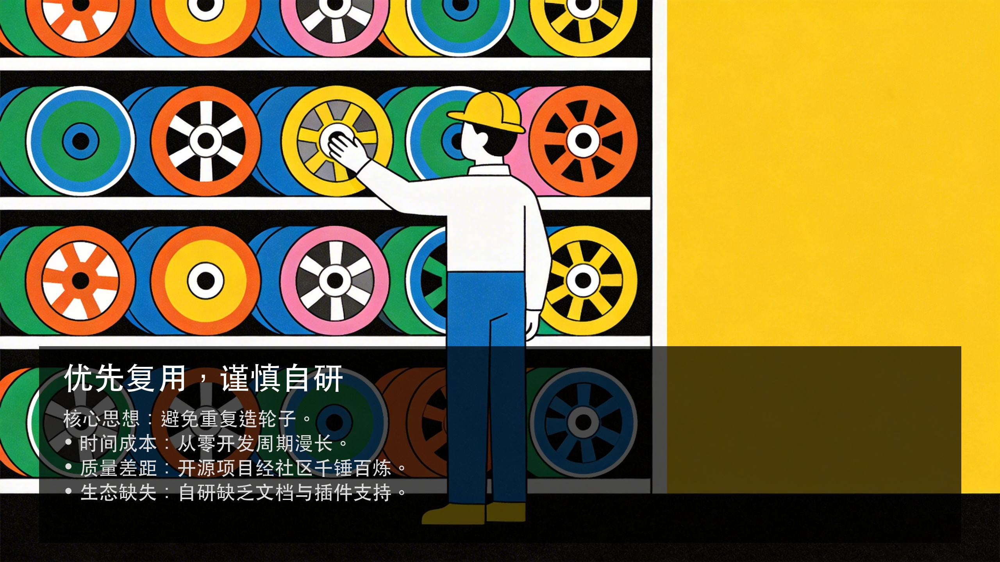
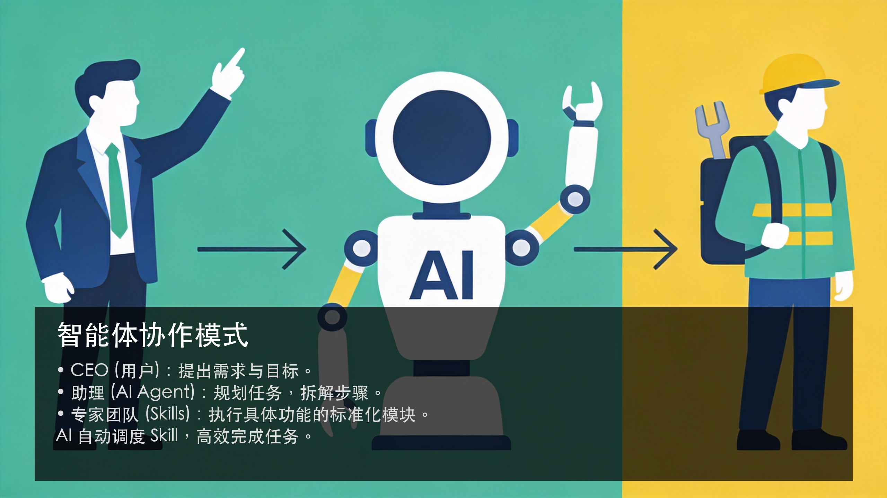

# 从极客玩具到大众利器：用 AI 唤醒 GitHub 的沉睡宝藏

互联网发展三十年来，留给我们最宝贵的遗产之一，就是那个名为“开源协作生态”的数字花园。

在这里，从 Linux 操作系统到 Python 编程语言，从 MySQL 数据库到 React 前端框架，无数顶尖开发者的智慧结晶被无私共享。这些开源项目极大地降低了技术门槛，加速了全球创新。然而，对于大多数非技术背景的普通用户来说，这座宝藏却似乎总是可望而不可即。

### 01. 可用性鸿沟：一道看不见的墙

你可能听说过很多神奇的开源工具，但当你满怀期待地打开它们的 GitHub 页面时，迎接你的往往是冷冰冰的“可用性鸿沟”。

环境配置是第一道拦路虎。 你只是想用一个工具，却被要求先安装 Python、Node.js，配置环境变量，处理各种版本冲突。光是这一步，就足以劝退绝大多数人。

命令行操作是第二道高墙。 就算你侥幸搞定了环境，面对黑底白字的终端窗口，需要记忆晦涩的指令和参数，没有直观的进度条，没有友好的界面引导。

这并非开发者的傲慢，而是因为很多开源项目本质上是“工具”而非“产品”。它们由开发者创造，天然地服务于习惯命令行的同类。这种错位，让开源软件长期以来只能是“极客的玩具”，而无法成为“大众的利器”。

### 02. 商业工具的秘密：开源的包装术

有趣的是，我们日常使用的很多商业软件，比如各种“格式工厂”、“视频转换神器”，其底层往往就是开源项目的集成与包装。

比如处理音视频的 FFmpeg，处理图像的 ImageMagick。商业软件的逻辑很简单：省去底层研发成本，专注做一套漂亮易用的界面（GUI），然后向用户收费。这本无可厚非，但带来的问题是同质化严重、功能被阉割，甚至存在广告弹窗和隐私风险。

那么，有没有一种可能，让我们能绕过这些中间商，直接享用最纯粹、强大的开源能力，却又不需要忍受命令行的折磨？

### 03. 顿悟：AI 就是那个“万能翻译器”

答案就在我们身边——AI。

想象一下，AI 就像一位全能的私人助理，而 GitHub 上的开源项目就是各领域的顶尖专家团队。

以前，你作为 CEO（用户），想让专家干活，必须亲自学“专家语言”（代码、命令行）。
现在，你只需要告诉 AI 助理：“帮我把这个视频下载下来”，或者“帮我把这些图片转成 PDF”。

AI 会充当“需求翻译器”：它听得懂你的自然语言，将其转化为底层的技术调用。
AI 也会充当“超级执行层”：它会在后台自动规划、调用合适的开源工具（比如 yt-dlp 或 FFmpeg），甚至自动编写胶水代码来连接它们。

在这个过程中，“Skill” 应运而生。

### 04. Skill：赋予代码“心智”

什么是 Skill？简单来说，Skill = 脚本 + Prompt。

*   脚本（Script）：解决了“怎么做”的问题（执行能力）。
*   提示词（Prompt）：解决了“何时做”的问题（认知能力）。

当我们将一个开源项目封装成 Skill，就是给它装上了一个“大脑”。这让 AI 不仅拥有了执行任务的手脚，更拥有了判断何时使用、如何使用的心智。

这彻底改变了软件的形态。
传统的 APP 是静态封装的，功能在发布时就已固定。
而 AI 驱动的 Skill 是动态组合的。AI 就像一个拥有海量“工具卡牌”的超级管家，根据你的需求，现场挑选并组合最合适的卡牌来完成任务。

### 05. 实战演练：打造你的数字化“三头六臂”

让我们以一个真实的场景为例：视频下载。

以前，你想下载 YouTube 或 B 站的视频，可能需要找各种第三方网站或插件，时灵时不灵。而在 GitHub 上，有一个封神级的开源项目叫 `yt-dlp`，功能强大但全是命令行操作。

现在，利用 AI，我们可以将它变成一个专属 Skill：

1.  需求分析：告诉 AI，“我要一个能下载全网视频的工具”。
2.  项目发现：AI 会迅速帮你锁定 `yt-dlp` 这个最佳方案。
3.  交互规划：AI 会像一个架构师一样，询问你的具体需求（如是否要下载字幕、最高画质等），并规划封装方案。
4.  自动开发：AI 自动生成 Skill 的代码和描述文件。
5.  运行迭代：在第一次运行时，AI 会指导你安装依赖（如 ffmpeg），甚至教你如何获取网站 Cookie。你把这些经验反馈给它，它会自动更新 Skill。

经过几次“运行-反馈-优化”的循环，你就拥有了一个稳定、强大的视频下载 Skill。以后只需扔给 AI 一个链接，它就能自动搞定一切。

### 结语

从今天起，你不再需要知道 GitHub 是什么，也不需要学会写代码。

你只需要有一个足够强大的 AI 助手，并学会用自然语言去指挥它。整个 GitHub 的开源宝藏，都将成为你个人能力的弹药库。

这不仅仅是工具的升级，更是个体能力的觉醒。在这个 AI 时代，让我们一起打破技术的围墙，真正实现“三头六臂、无所不能”的数字化自由。

## images展示

::: gallery

:::
