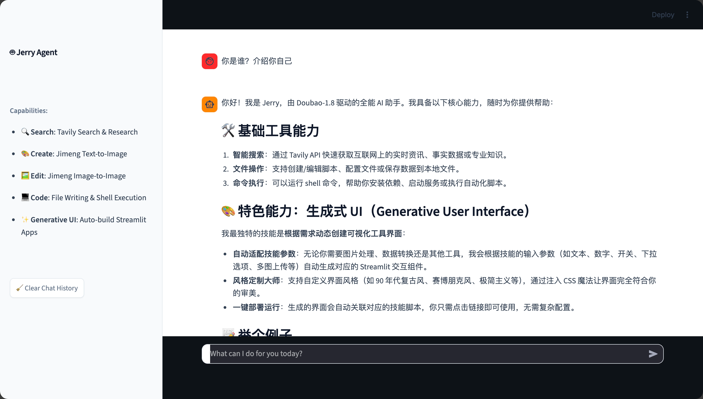
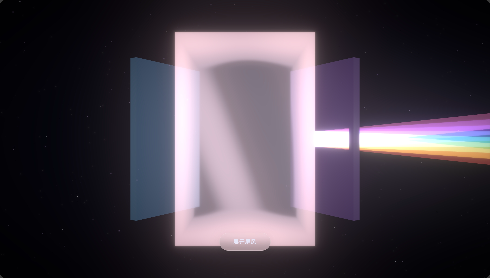
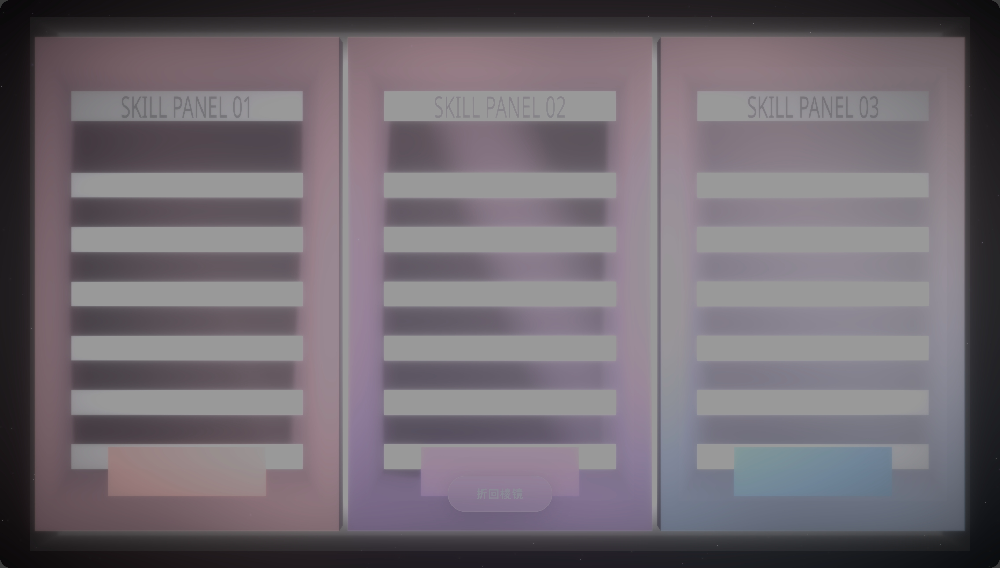

# 我的 Idea：从对话框到“晶体与折纸”

在我的构想中，Jerry 不是一个只会陪聊的助手，而是一个 UI-First 的 Skills Runtime。这听起来有点拗口，但简单来说，就是把那些复杂的 AI 能力，变成一个个看得见、摸得着的“界面”。

我希望用户打开它时，看到的不是空荡荡的输入框，而是一张清晰的“能力地图”，告诉用户“我能为你做什么”；当任务开始时，用户面对的不是一堆滚动的代码日志，而是一个个像折纸一样展开的、边界清晰的“任务面”；当任务结束或出错时，系统给出的不是报错代码，而是一份用“人话”写成的、可追溯的复盘记录。

为了实现这个愿望，我引入了一个非常迷人的隐喻——“晶体与折纸”。

我把整个交互界面想象成一个三棱镜（Console）：
- 转到 A 面，它是能力地图，展示所有可用的 Skill；
- 转到 B 面，它是任务执行区，每一个 Skill 都在这里不仅能“跑”，还能被实时“看见”进度与状态；
- 转到 C 面，它是可追溯的记录，像黑匣子一样记录下每一次决策与产物，但用的是温柔的自然语言。

我甚至希望这些界面能像屏风一样展开，既有晶体的通透感，又有折纸的秩序感。这就是 Jerry 的灵魂：用“响应式/生成式 UI”来完成任务，而对话只是最后的兜底。

## images展示

::: gallery

:::
